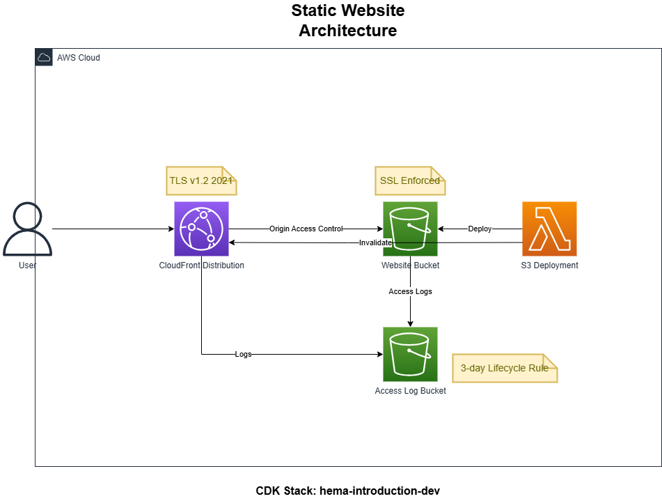

# HEMA紹介

---

# HEMAとは

* Historical European Martial Arts
* 西洋剣術
* HEMAは「ヘマ」ではなく「ヒマ」と発音
* 西洋ではHEMA人口はある程度いるらしいが、日本人はほとんどいないらしい。
* Youtubeで「HEMA」を検索すると、かっこいい動画がたくさん出てくる。

---

# 動画

* https://drive.google.com/file/d/12YIRaIGUymf9tt5IEZ-vG5_QW42Z56TB/view?usp=drive_link

---

# ルール

* 相手のどこを打ってもよい
* 足は1点、それ以外は2点のような計算らしい
* 武器は片手の剣、両手の剣、盾等様々

---

# 感想

* 打たれても痛くはなかった
* 防具が重く動きにくい
  * 暑い!
* 剣が(スポーツチャンバラ)より重く、腕の筋力が必要

---

# 参加方法

* Meetupというサービスの[HEMA Tokyo](https://www.meetup.com/hema-tokyo/)というグループから申し込む
* 世田谷区の砧公園で毎週日曜日に練習を開催
* 参加費は無料
* 道具は(少なくとも最初のうちは)貸してくれる
* ほぼ外国人で構成されており、**簡単な英語でのコミュニケーションが必須!**
* もし本当に参加する場合は、ぜひ私に声をかけてください。

---

# 終わり

* じゃない!

---

# AWS構成図

---

# 先ほどのAWS構成図の作成方法

* CDKコードからClaude 3.7を使って生成!
  * 参考: https://dev.classmethod.jp/articles/aws-drawio-genai/

---

# 使用した主な技術

* Markdownでスライド作成: marp
* AWSインフラ定義: AWS CDK
* CDKプロジェクトの管理: projen
* コード整形: prettier
* コードチェック: eslint
* セキュリティチェック: cdk-nag
* CI/CD: GitHub Actions
* 生成AI: Claude 3.7, GitHub Copilot

---

# やり残したこと

* 動画をAWS Elemental MediaConvertで適当な形式に変換して、S3にアップロードし、AWSから動画を配信する。

---

# 参考

* 今回の発表に使用したGitHubリポジトリ
  * https://github.com/yutaro-sakamoto/hema-introduction